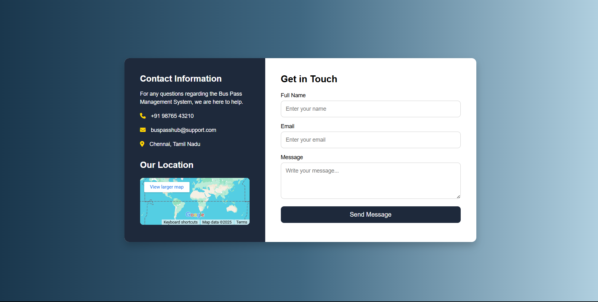

**BusPassHub** is a modern web application built to simplify the bus pass management process for educational institutions and transport departments. It allows students and users to apply for passes easily while enabling administrators to manage, approve, and track bus passes efficiently through an interactive dashboard.
## 🔍 Overview

**BusPassHub** is created as part of an academic project to provide a paperless and user-friendly system for managing bus passes. Users can apply for a new pass, view services, and contact support, while the admin panel provides full control over applications and pass records.

This project was built using HTML, CSS, and JavaScript with a focus on clean UI/UX design principles.

## 🌟 Key Features

### 👤 User Pages

- **🏠 Home Page:** A welcoming page with brief project introduction and easy navigation.
- **ℹ️ About Page:** Provides background and objectives of the BusPassHub system.
- **➕ Add Pass:** Allows users to fill in a form to apply for a new bus pass.
- **📞 Contact Page:** Users can get in touch with admin or support using this form.
- **🛠️ Services Page:** Displays all available transport services and features offered by the system.

### 🔐 Admin Dashboard

- **🔑 Admin Login:** Secure login system to restrict access to admin features.
- **📊 Dashboard Main Page:** Displays important metrics, user data, and pass summaries.
- **📝 Manage Applications:** View and process new pass applications.
- **🚌 Manage Passes:** Update or cancel issued passes.
- **📂 Category Handling:** Organize categories (student, staff, etc.)
- **🔍 Search Feature:** Quickly search and filter records.
- **📈 Reports (Optional):** View system usage reports (coming soon).

## 🛠️ Tech Stack

| Layer     | Technology         |
|-----------|--------------------|
| Frontend  | HTML5, CSS3, JavaScript |
| Design    | Figma (UI Prototypes) |
| Hosting (Optional) | GitHub Pages |
| IDE       | Visual Studio Code |

---

